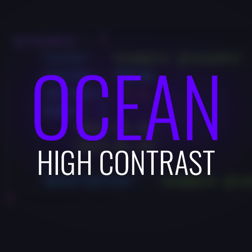
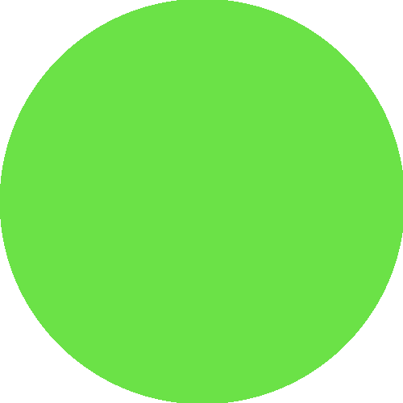
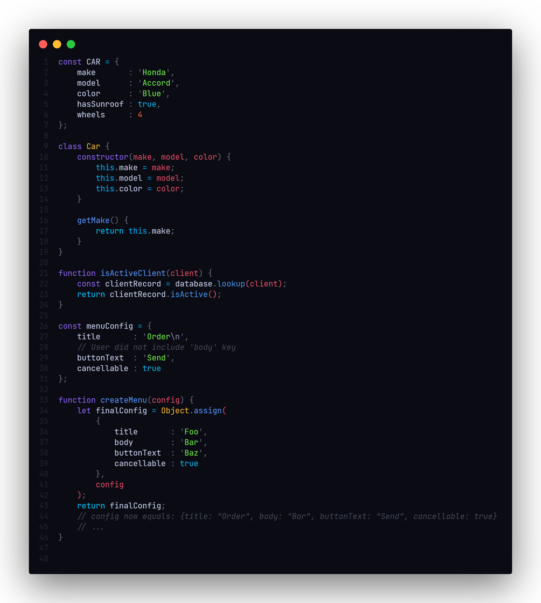

# Ocean High Contrast

Ocean High Contrast is a dark theme with bright and vibrant colors and a clean, minimalistic design. 

## Table of Contents
- [Introduction](#introduction)
- [Colors](#color-pallete)
- [Screenshots](#screenshots)
- [Specification](#specifications)
- [Changing the accent color](#changing-the-accent-color)


### Color Pallete

|   | Color | Hex | Scope |
| --- | --- | --- | --- |
| | Red | #F04F6A | Arguments |
| | Orange | #FE6A29 | Int, float, numbers |
| | Yellow | #F0B22D | Class |
| | Green | #6BE247 | Strings | 
| | Blue | #03BBF5 | Function |
| | Cyan | #00C3FF | Keywords, Boolean |
| | Purple | #9466FF | Storage |
| | White | #C0C6E4 | Variables |
| | Gray | #464B5D | Comments |
| | Black | #0B0C13 | Background |

### Screenshots



    

### Specifications

- Font - [JetBrains Mono](https://www.jetbrains.com/lp/mono/)
- [GlassItVSC](https://marketplace.visualstudio.com/items?itemName=s-nlf-fh.glassit) - For making the background transparent.

### Changing the Accent color

A quick way to do  this is go to your `settings.json`, paste the code below, highlight the `#6d5cff`, press <kbd>Ctrl</kbd> + <kbd>H</kbd> / <kbd>⌘</kbd>+ <kbd>H</kbd>   and replace with the color of your choice.
```json
  "workbench.colorCustomizations": {
    "[Ocean High Contrast]": {
      "activityBarBadge.background": "#6d5cff",
      "activityBar.activeBorder": "#6d5cff",
      "list.activeSelectionForeground": "#6d5cff",
      "list.inactiveSelectionForeground": "#6d5cff",
      "list.highlightForeground": "#6d5cff",
      "scrollbarSlider.activeBackground": "#6d5cff50",
      "editorSuggestWidget.highlightForeground": "#6d5cff",
      "textLink.foreground": "#6d5cff",
      "progressBar.background": "#6d5cff",
      "pickerGroup.foreground": "#6d5cff",
      "tab.activeBorder": "#6d5cff",
      "notificationLink.foreground": "#6d5cff",
      "editorWidget.resizeBorder": "#6d5cff",
      "editorWidget.border": "#6d5cff",
      "settings.modifiedItemIndicator": "#6d5cff",
      "settings.headerForeground": "#6d5cff",

      "panelTitle.activeBorder": "#6d5cff",
      "breadcrumb.activeSelectionForeground": "#6d5cff",
      "menu.selectionForeground": "#6d5cff",
      "menubar.selectionForeground": "#6d5cff",
      "editor.findMatchBorder": "#6d5cff",
      "statusBarItem.remoteBackground": "#6d5cff"
    }
  }
```

For example, i'm replacing it with `#fa2f62`


```json
  "workbench.colorCustomizations": {
    "[Ocean High Contrast]": {
      "activityBarBadge.background": "#fa2f62",
      "activityBar.activeBorder": "#fa2f62",
      "list.activeSelectionForeground": "#fa2f62",
      "list.inactiveSelectionForeground": "#fa2f62",
      "list.highlightForeground": "#fa2f62",
      "scrollbarSlider.activeBackground": "#fa2f6250",
      "editorSuggestWidget.highlightForeground": "#fa2f62",
      "textLink.foreground": "#fa2f62",
      "progressBar.background": "#fa2f62",
      "pickerGroup.foreground": "#fa2f62",
      "tab.activeBorder": "#fa2f62",
      "notificationLink.foreground": "#fa2f62",
      "editorWidget.resizeBorder": "#fa2f62",
      "editorWidget.border": "#fa2f62",
      "settings.modifiedItemIndicator": "#fa2f62",
      "settings.headerForeground": "#fa2f62",
      "panelTitle.activeBorder": "#fa2f62",
      "breadcrumb.activeSelectionForeground": "#fa2f62",
      "menu.selectionForeground": "#fa2f62",
      "menubar.selectionForeground": "#fa2f62",
      "editor.findMatchBorder": "#fa2f62",
      "statusBarItem.remoteBackground": "#fa2f62"
    }
  }
```

#### Preview


*This theme was inspired by the [Material Theme](https://marketplace.visualstudio.com/items?itemName=Equinusocio.vsc-material-theme) Ocean High Contrast*