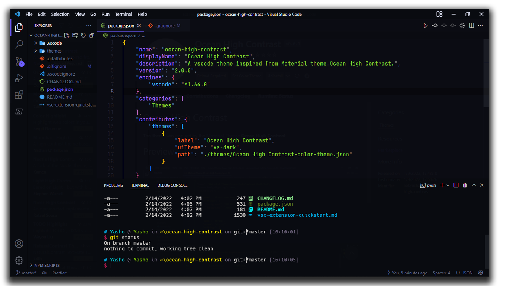
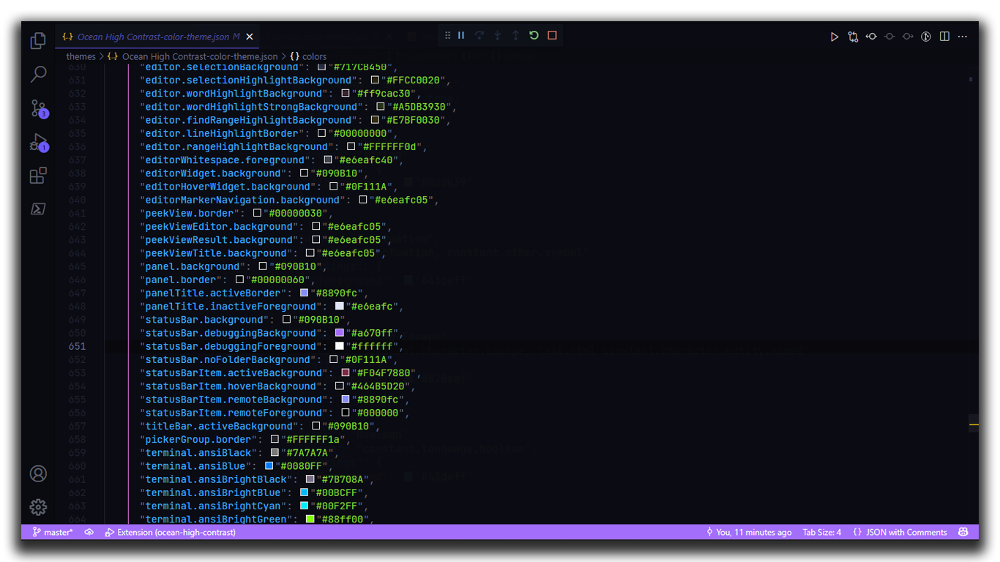
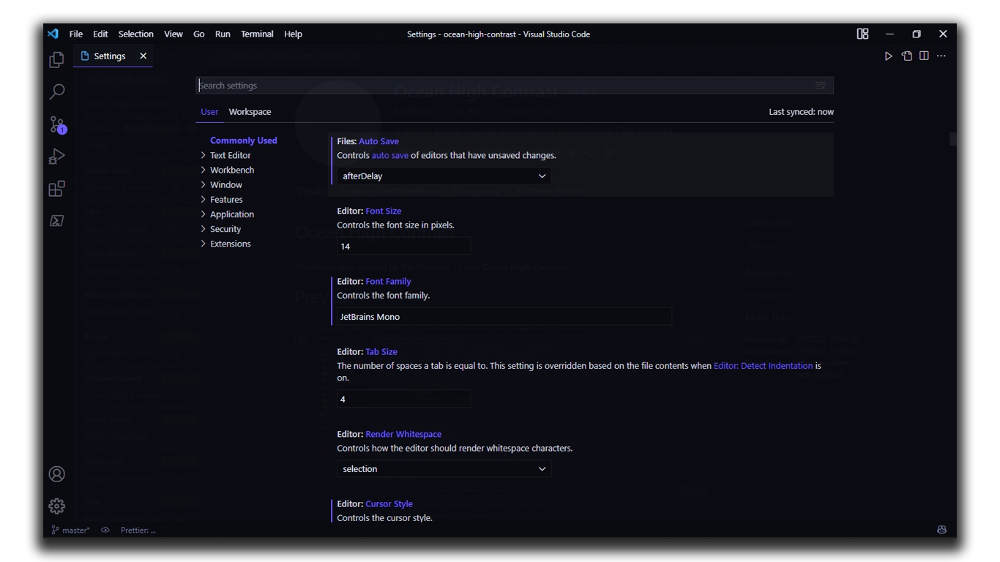
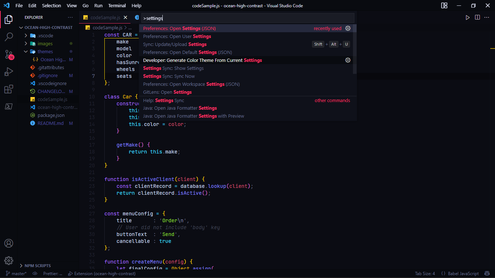

# Ocean High Contrast

Ocean High Contrast is a dark theme with bright and vibrant colors and a clean, minimalistic design.

## Screenshots






## Changing the Accent color

A quick way to do this is go to your `settings.json`, paste the code below, highlight the `#6d5cff`, press <kbd>Ctrl</kbd> + <kbd>H</kbd> to replace the color (<kbd>⌘</kbd>+ <kbd>H</kbd> on Mac) with the hex color of your choice.

```json
  "workbench.colorCustomizations": {
    "[Ocean High Contrast]": {
      "activityBarBadge.background": "#6d5cff",
      "activityBar.activeBorder": "#6d5cff",
      "list.activeSelectionForeground": "#6d5cff",
      "list.inactiveSelectionForeground": "#6d5cff",
      "list.highlightForeground": "#6d5cff",
      "scrollbarSlider.activeBackground": "#6d5cff50",
      "editorSuggestWidget.highlightForeground": "#6d5cff",
      "textLink.foreground": "#6d5cff",
      "progressBar.background": "#6d5cff",
      "pickerGroup.foreground": "#6d5cff",
      "tab.activeBorder": "#6d5cff",
      "notificationLink.foreground": "#6d5cff",
      "editorWidget.resizeBorder": "#6d5cff",
      "editorWidget.border": "#6d5cff",
      "settings.modifiedItemIndicator": "#6d5cff",
      "settings.headerForeground": "#6d5cff",

      "panelTitle.activeBorder": "#6d5cff",
      "breadcrumb.activeSelectionForeground": "#6d5cff",
      "menu.selectionForeground": "#6d5cff",
      "menubar.selectionForeground": "#6d5cff",
      "editor.findMatchBorder": "#6d5cff",
      "statusBarItem.remoteBackground": "#6d5cff"
    }
  }
```

For example, here I'm replacing it with `#fa2f62`

```json
  "workbench.colorCustomizations": {
    "[Ocean High Contrast]": {
      "activityBarBadge.background": "#fa2f62",
      "activityBar.activeBorder": "#fa2f62",
      ...
    }
  }
```



_This theme is a fork of the [Material Theme's](https://marketplace.visualstudio.com/items?itemName=Equinusocio.vsc-material-theme) Ocean High Contrast_

---
Read my blog: https://notyasho.netlify.app/blogs
[Contact Me](https://notyasho.netlify.app/contact)
